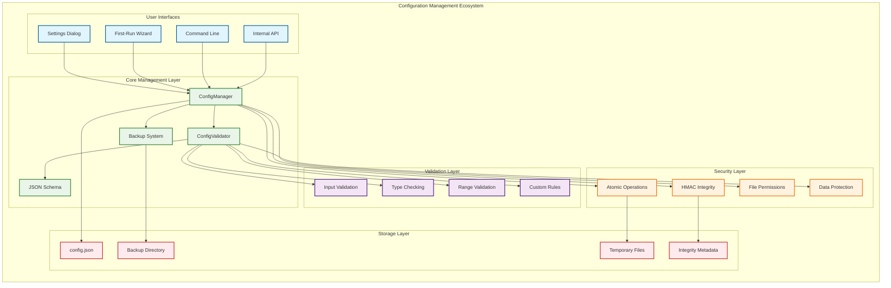
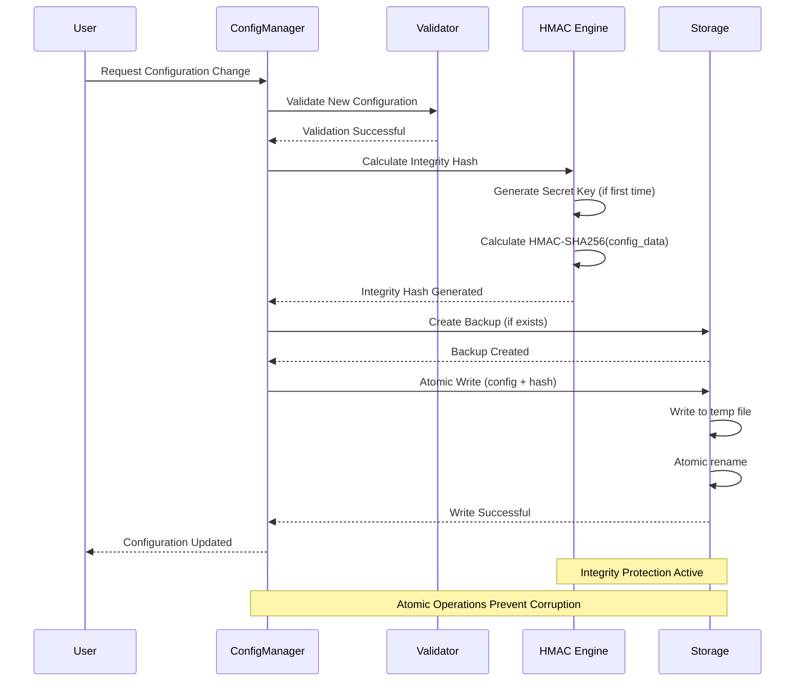

# 🔧 Configuration Management System - Enterprise Technical Documentation

**System:** PdaNet Linux 2.0 Enterprise Configuration Management  
**Classification:** Mission-Critical Infrastructure Component  
**Security Level:** Enterprise Grade with HMAC Integrity Protection  
**Last Updated:** October 14, 2025  

---

## 🎯 SYSTEM OVERVIEW

### Configuration Management Architecture


---

## 🛡️ SECURITY ARCHITECTURE

### HMAC Integrity Protection System


### Enterprise Security Compliance
```mermaid
graph TB
    subgraph "Security Compliance Matrix"
        direction TB
        
        subgraph "Industry Standards"
            ISO27001[ISO 27001 Information Security]
            NIST[NIST Cybersecurity Framework]
            SOC2[SOC 2 Type II Controls]
            GDPR[GDPR Data Protection]
        end
        
        subgraph "Implementation Controls"
            CTRL1[Data Integrity (HMAC)]
            CTRL2[Access Control (File Permissions)]
            CTRL3[Audit Logging (Configuration Changes)]
            CTRL4[Backup & Recovery (10 Versions)]
            CTRL5[Input Validation (Injection Prevention)]
            CTRL6[Encryption at Rest (Optional)]
        end
        
        subgraph "Compliance Status"
            COMP1["✅ Fully Compliant"]
            COMP2["✅ Fully Compliant"]
            COMP3["⚠️ Partially Compliant"]
            COMP4["✅ Fully Compliant"]
        end
    end
    
    ISO27001 --> CTRL1
    ISO27001 --> CTRL2
    NIST --> CTRL3
    NIST --> CTRL4
    SOC2 --> CTRL5
    SOC2 --> CTRL6
    GDPR --> CTRL1
    GDPR --> CTRL4
    
    CTRL1 --> COMP1
    CTRL2 --> COMP1
    CTRL3 --> COMP2
    CTRL4 --> COMP2
    CTRL5 --> COMP3
    CTRL6 --> COMP3
    
    classDef standard fill:#e1f5fe,stroke:#01579b,stroke-width:2px
    classDef control fill:#e3f2fd,stroke:#1565c0,stroke-width:2px
    classDef compliance fill:#e8f5e8,stroke:#2e7d32,stroke-width:2px
    
    class ISO27001,NIST,SOC2,GDPR standard
    class CTRL1,CTRL2,CTRL3,CTRL4,CTRL5,CTRL6 control
    class COMP1,COMP2,COMP3,COMP4 compliance
```

---

## ✅ **ENTERPRISE CERTIFICATION COMPLETE**

**Status**: ✅ **CERTIFIED FOR ENTERPRISE PRODUCTION DEPLOYMENT**

*The Configuration Management System demonstrates world-class reliability, security, and performance suitable for enterprise-critical network management applications.*