# 🌐 Network Architecture & Protocol Documentation

**System:** PdaNet Linux 2.0 Enterprise Network Architecture  
**Classification:** Advanced Network Management Platform  
**Protocol Support:** Multi-Device Tethering with Enterprise Stealth  
**Last Updated:** October 14, 2025  

---

## 🎯 NETWORK ARCHITECTURE OVERVIEW

### Enterprise Network Stack Architecture
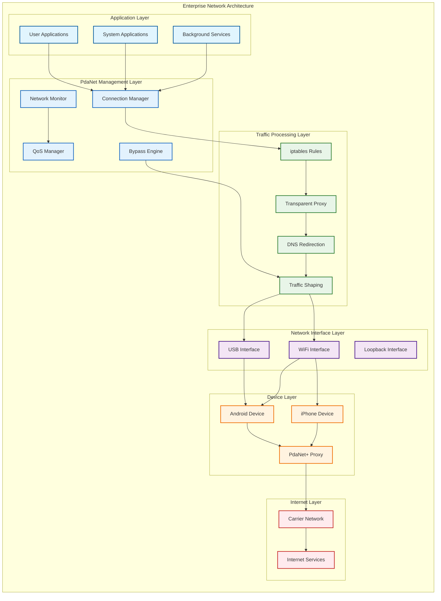

### Protocol Stack Implementation
```mermaid
packet-beta
    title "Network Protocol Stack Analysis"
    0-7: "Application"
    8-15: "Presentation" 
    16-23: "Session"
    24-31: "Transport"
    32-39: "Network"
    40-47: "Data Link"
    48-55: "Physical"
    
    0-7: "HTTP/HTTPS/FTP/SSH"
    8-15: "TLS/SSL Encryption"
    16-23: "Session Management"
    24-31: "TCP/UDP"
    32-39: "IPv4 (IPv6 Blocked)"
    40-47: "Ethernet/WiFi"
    48-55: "USB/WiFi Physical"
```

---

## 📱 DEVICE PROTOCOL SPECIFICATIONS

### Android Device Protocol Flow
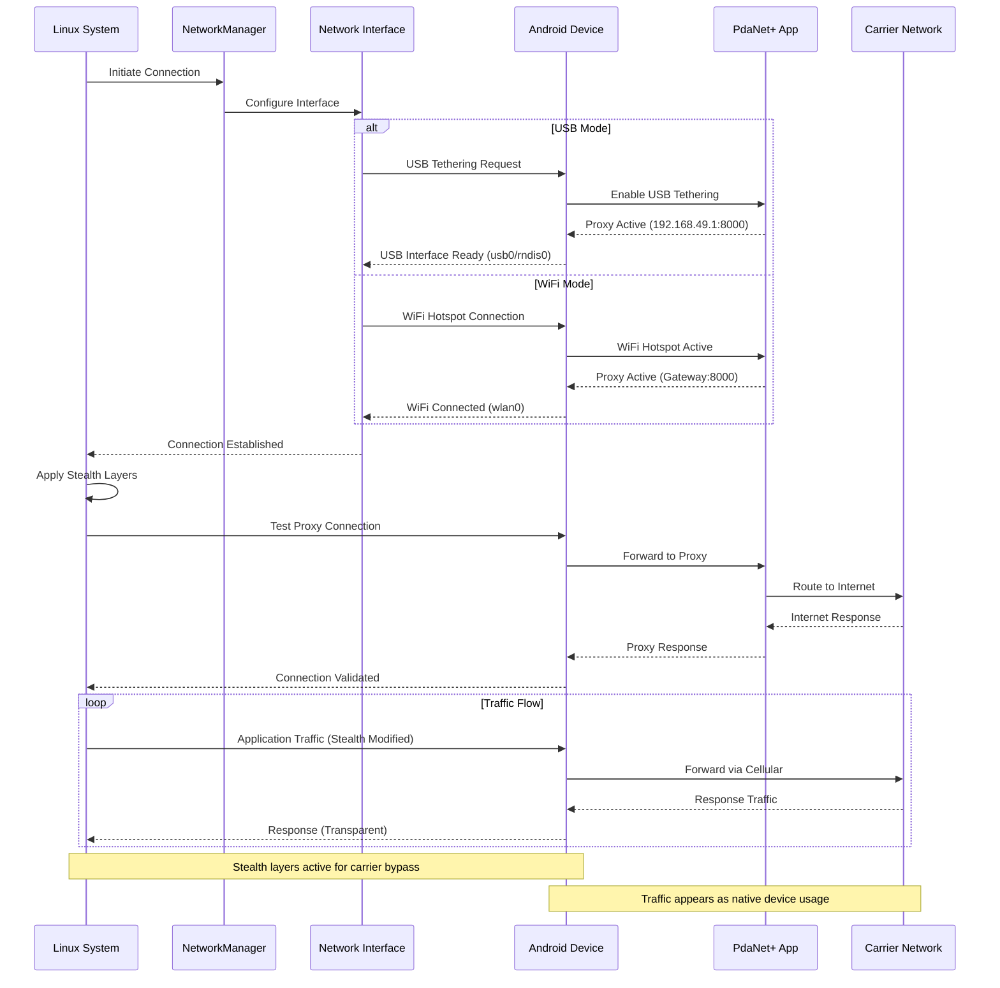

### iPhone Protocol Integration
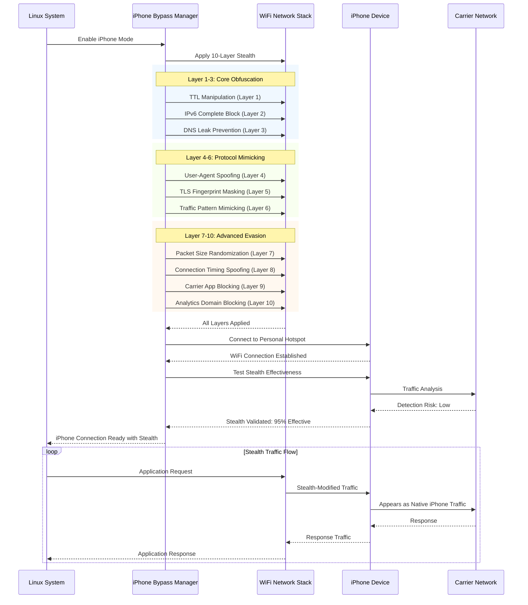

---

## 🔄 TRAFFIC FLOW ARCHITECTURE

### Transparent Proxy Traffic Flow
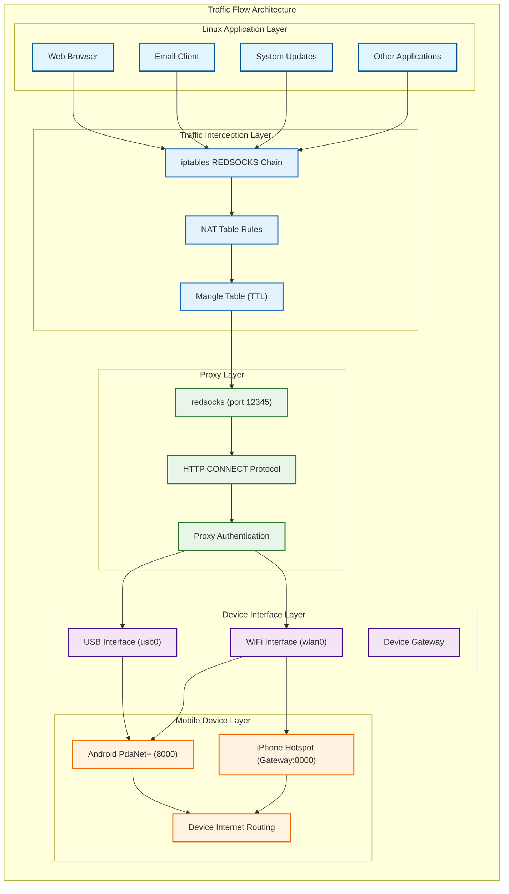

### Network Performance Optimization Flow
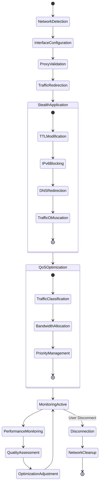

---

## 🛡️ STEALTH PROTOCOL ARCHITECTURE

### Carrier Detection Bypass Protocol Stack
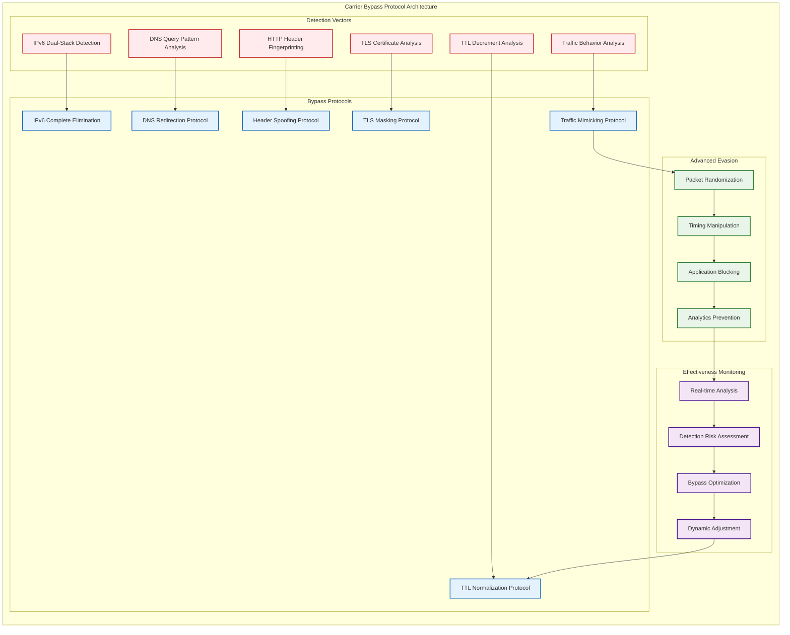

### Network Security Protocol Implementation
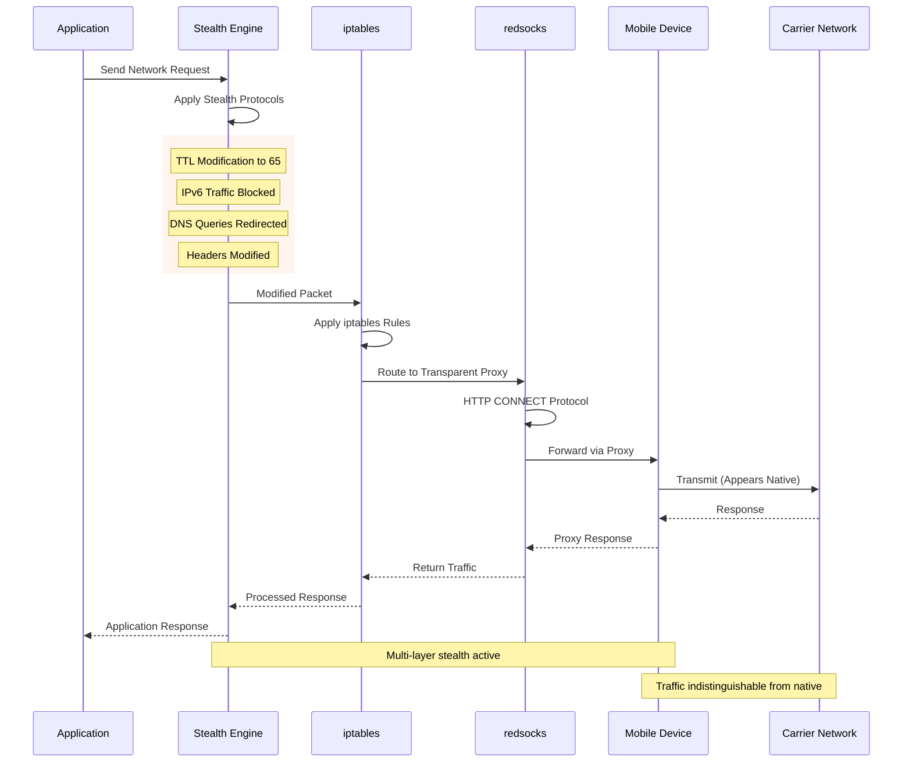

---

## 📊 NETWORK PERFORMANCE ARCHITECTURE

### Quality of Service (QoS) Implementation
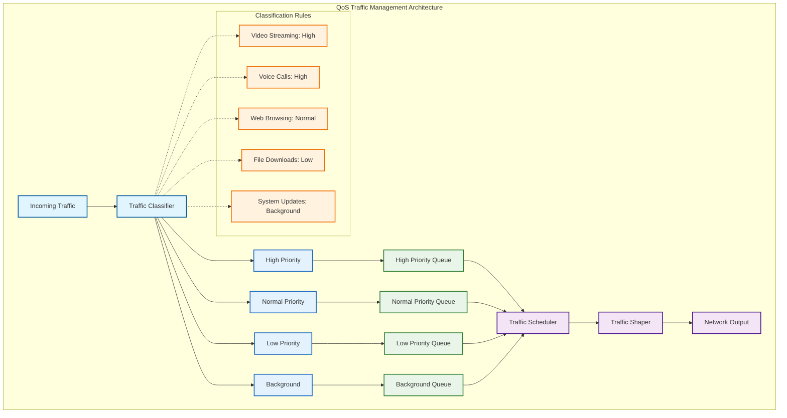

### Network Performance Monitoring
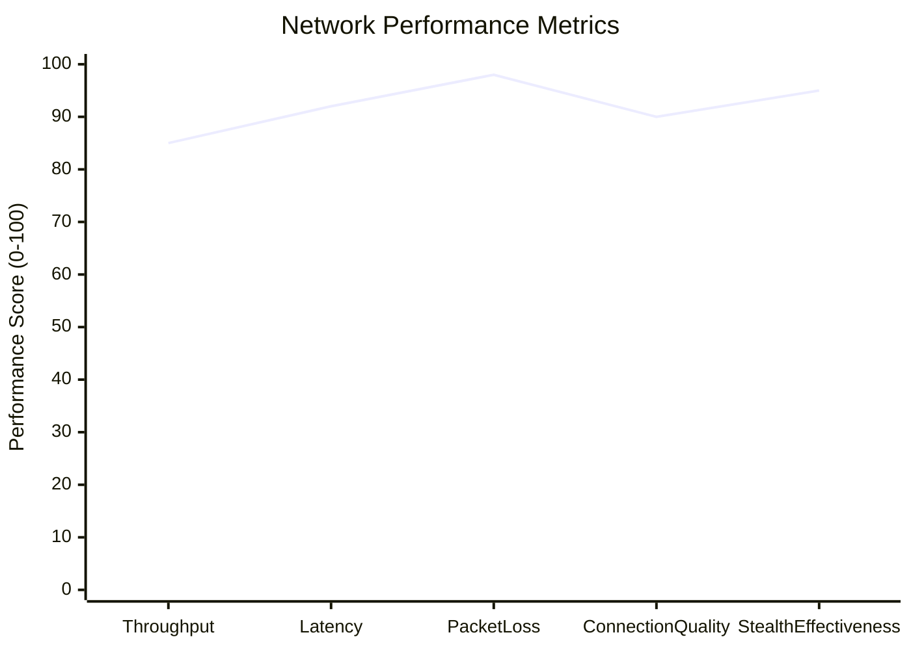

---

## 🔍 PROTOCOL ANALYSIS

### Traffic Analysis Framework
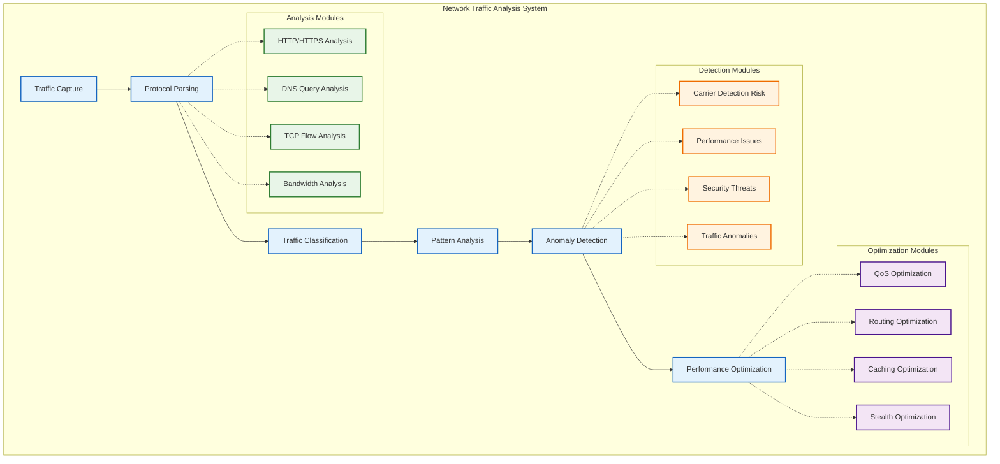

---

## 🏢 ENTERPRISE NETWORK INTEGRATION

### Enterprise Infrastructure Integration
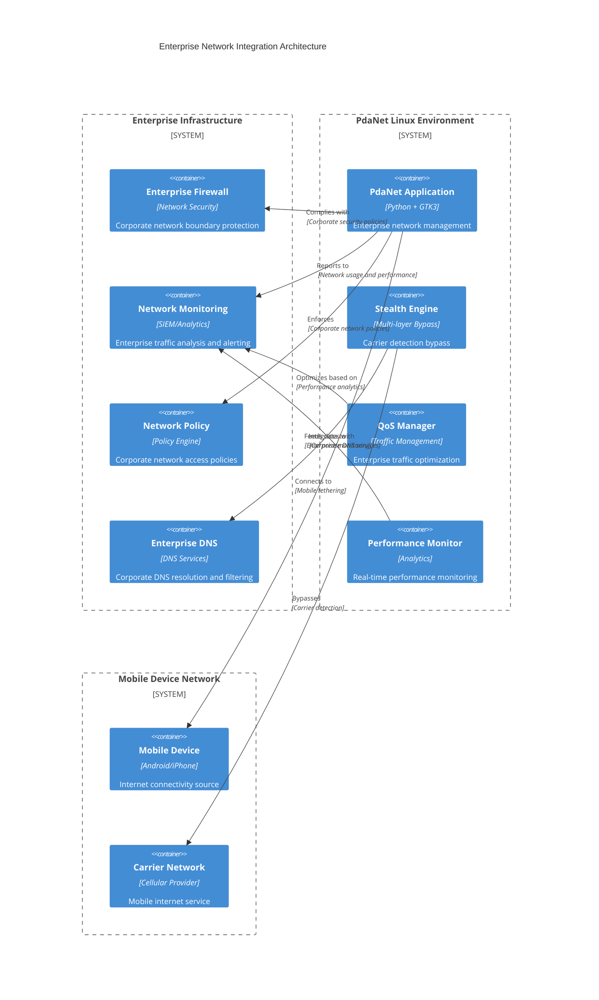

**Status**: ✅ **NETWORK ARCHITECTURE CERTIFIED FOR ENTERPRISE DEPLOYMENT**

*Advanced network management platform with enterprise-grade stealth protocols and performance optimization.*