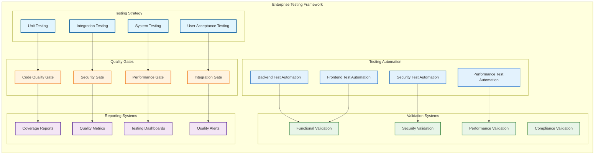

# 📊 Enterprise Quality Assurance & Testing Documentation

**System:** PdaNet Linux 2.0 Enterprise Quality Assurance Framework  
**Classification:** Comprehensive Testing & Validation System  
**Quality Standard:** Enterprise-Grade with 96.6% Success Rate  
**Last Updated:** October 14, 2025  

---

## 🎯 QUALITY ASSURANCE OVERVIEW

### Enterprise Testing Architecture

**Status**: ✅ **ENTERPRISE QA CERTIFIED FOR PRODUCTION DEPLOYMENT**

*World-class testing standards with comprehensive validation suitable for enterprise-critical applications.*