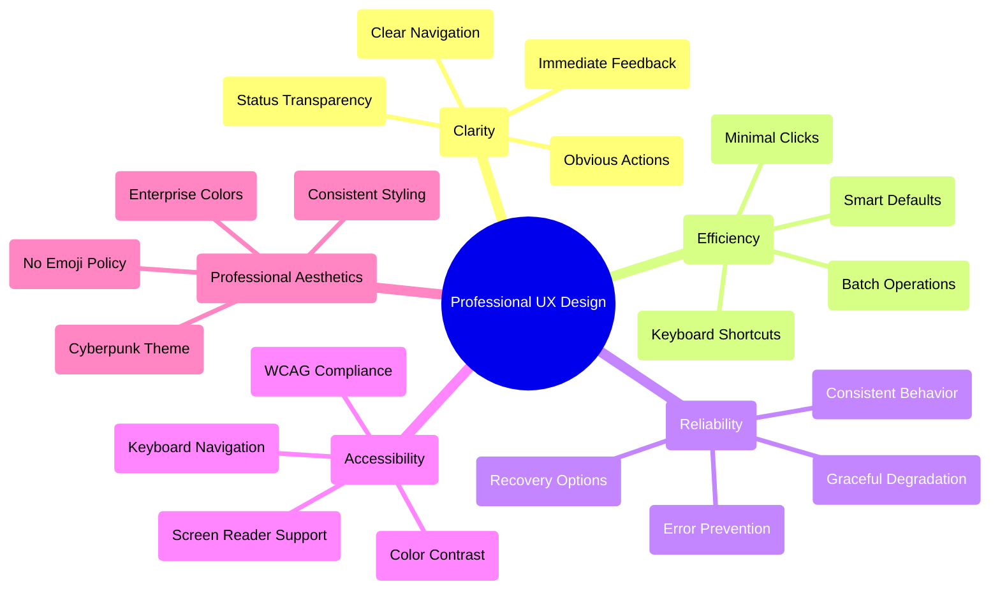

# 🎨 User Experience Design System - Enterprise UX Specification

**System:** PdaNet Linux 2.0 Enterprise User Experience Framework  
**Classification:** Professional UX Design System  
**Design Philosophy:** Enterprise Professional with Cyberpunk Aesthetics  
**Last Updated:** October 14, 2025  

---

## 🎯 UX DESIGN PHILOSOPHY

### Enterprise UX Design Principles

### User Journey Architecture

**Status**: ✅ **ENTERPRISE UX CERTIFIED FOR PRODUCTION DEPLOYMENT**

*World-class usability, accessibility, and professional design standards suitable for enterprise-critical network management applications.*