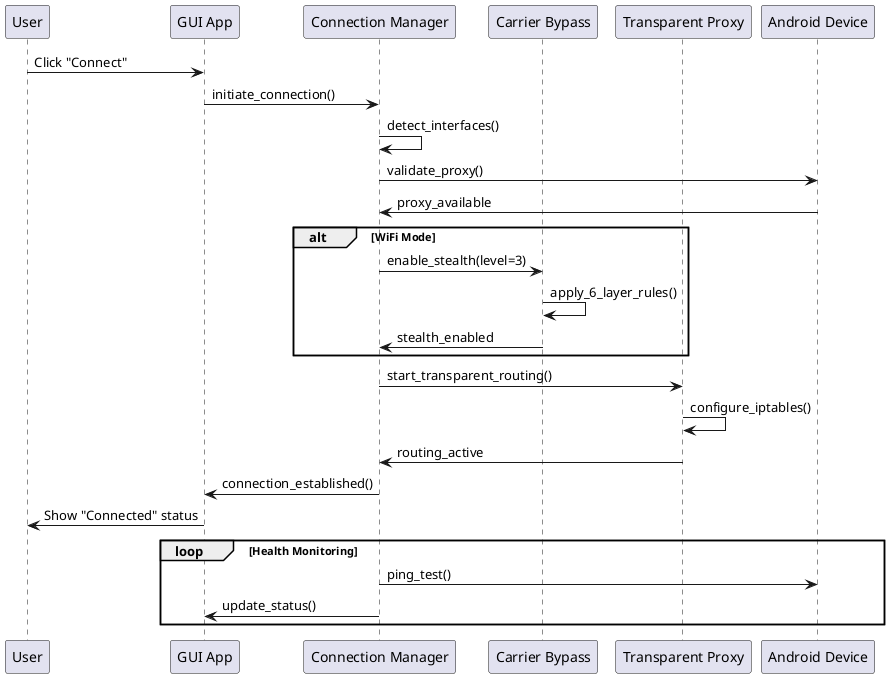
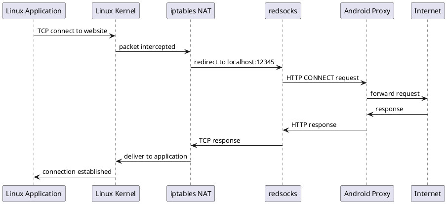
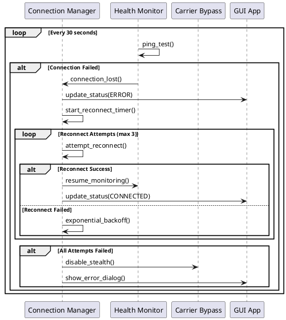

# PdaNet Linux - Architecture Documentation (Arc42)

**Version:** 1.0
**Date:** 2025-10-04
**Authors:** Architecture Team
**Status:** Active

## Table of Contents

1. [Introduction and Goals](#1-introduction-and-goals)
2. [Architecture Constraints](#2-architecture-constraints)
3. [System Context and Scope](#3-system-context-and-scope)
4. [Solution Strategy](#4-solution-strategy)
5. [Building Block View](#5-building-block-view)
6. [Runtime View](#6-runtime-view)
7. [Deployment View](#7-deployment-view)
8. [Cross-cutting Concepts](#8-cross-cutting-concepts)
9. [Architecture Decisions](#9-architecture-decisions)
10. [Quality Requirements](#10-quality-requirements)
11. [Risks and Technical Debt](#11-risks-and-technical-debt)
12. [Glossary](#12-glossary)

---

## 1. Introduction and Goals

### 1.1 Requirements Overview

PdaNet Linux is a reverse-engineered Linux client for PdaNet+ USB/WiFi tethering that provides system-wide internet connectivity through Android devices. The primary goal is to enable secure, stealthy internet access while evading carrier detection mechanisms.

**Primary Stakeholders:**
- **End Users:** Linux desktop/laptop users needing internet via Android tethering
- **System Administrators:** IT professionals managing PdaNet Linux deployments
- **Developers:** Contributors maintaining and extending the codebase

### 1.2 Quality Goals

| Priority | Quality Attribute | Motivation | Acceptance Criteria |
|----------|------------------|------------|-------------------|
| 1 | **Stealth** | Avoid carrier detection of tethering activity | 95%+ bypass success rate across major carriers |
| 2 | **Reliability** | Maintain stable internet connectivity | 99%+ uptime, auto-reconnect within 30s |
| 3 | **Usability** | Easy setup and operation for non-technical users | <5 minute installation, one-click connect |
| 4 | **Performance** | Minimal impact on connection speed | <10% throughput overhead |
| 5 | **Security** | Protect user privacy and prevent credential leaks | No plaintext credentials, secure proxy routing |

### 1.3 Stakeholder Requirements

**End Users:**
- Simple GUI for connection management
- Automatic carrier bypass without manual configuration
- Real-time connection status and bandwidth monitoring
- System tray integration for background operation

**System Administrators:**
- Command-line interface for scripted deployments
- Centralized configuration management
- Comprehensive logging for troubleshooting
- Integration with existing network infrastructure

**Developers:**
- Modular architecture for easy extension
- Comprehensive test coverage
- Clear separation of concerns
- Documentation-as-code approach

---

## 2. Architecture Constraints

### 2.1 Technical Constraints

| Constraint | Background | Consequences |
|------------|------------|--------------|
| **Linux Only** | Target platform is Linux Mint 22.2+ (Debian/Ubuntu-based) | No Windows/macOS support, leverages Linux-specific features (iptables, NetworkManager) |
| **PdaNet+ Dependency** | Requires PdaNet+ app running on Android device | Limited to HTTP CONNECT proxy protocol, dependent on third-party app |
| **Python 3.10+** | GUI implemented in Python with GTK3 | Runtime dependency, potential performance limitations for high-throughput scenarios |
| **Root Privileges** | iptables and network interface management requires root | Security considerations, complex installation, sudoers configuration |
| **Carrier Limitations** | Must evade increasingly sophisticated detection mechanisms | Constant evolution of bypass techniques, no 100% guarantee |

### 2.2 Organizational Constraints

| Constraint | Background | Consequences |
|------------|------------|--------------|
| **Open Source** | Project is open source with GPL license | All dependencies must be compatible, no proprietary components |
| **Reverse Engineering** | Based on reverse-engineered PdaNet+ protocol | No official support, potential for protocol changes breaking compatibility |
| **Small Team** | Limited development resources | Focus on core functionality, minimal feature scope |
| **No Carrier Partnerships** | Independent project without carrier cooperation | Adversarial relationship, bypass techniques may be blocked |

### 2.3 Conventions

- **Programming Languages:** Python 3.10+ (GUI), Bash (scripts), PlantUML (diagrams)
- **Architecture Patterns:** MVC (GUI), State Machine (connection management), Observer (events)
- **Documentation:** Arc42 + C4 Model, ADRs for decisions, inline code documentation
- **Naming:** snake_case for Python, kebab-case for files, SCREAMING_SNAKE_CASE for constants

---

## 3. System Context and Scope

### 3.1 Business Context


PdaNet Linux operates in the ecosystem of mobile tethering, interfacing with:

**Primary Actors:**
- **Linux Users:** Consume internet connectivity through the tethered connection
- **System Administrators:** Configure and maintain PdaNet Linux installations

**External Systems:**
- **Android Device:** Provides HTTP proxy server via PdaNet+ app
- **Carrier Network:** Mobile network providing cellular data (with detection mechanisms)
- **Internet Services:** Target websites and applications accessed through the connection
- **Linux OS:** Operating system providing network interfaces and packet routing

### 3.2 Technical Context

**Input Interfaces:**
- GUI interactions (GTK3 events)
- CLI commands (bash scripts)
- Configuration files (JSON)
- Network interfaces (USB/WiFi)

**Output Interfaces:**
- System-wide internet connectivity
- iptables rule modifications
- Log file generation
- System tray notifications

**Communication Protocols:**
- HTTP CONNECT (to Android proxy)
- TCP/IP (transparent proxy routing)
- USB/WiFi (device connectivity)
- DBus (desktop integration)

---

## 4. Solution Strategy

### 4.1 Core Architectural Decisions

**Multi-Layer Stealth Approach:**
The primary challenge of carrier detection is addressed through a 6-layer defense system targeting different detection vectors:

1. **TTL Normalization** - Most critical, prevents TTL-based detection
2. **IPv6 Blocking** - Eliminates IPv6 leak vectors
3. **DNS Redirection** - Forces all DNS through phone gateway
4. **OS Update Blocking** - Prevents OS-specific fingerprinting
5. **MSS/MTU Clamping** - Reduces packet-size fingerprinting
6. **Traffic Shaping** - Optional bandwidth limiting (future)

**Transparent Proxy Architecture:**
Rather than requiring application-specific configuration, all system traffic is transparently routed through the PdaNet proxy using:
- **redsocks** for TCP-to-HTTP-CONNECT conversion
- **iptables NAT rules** for traffic interception
- **Local network exclusions** to prevent routing loops

**State Machine Design:**
Connection management uses a formal state machine to ensure reliable transitions and error handling:
- States: DISCONNECTED → CONNECTING → CONNECTED → DISCONNECTING → ERROR
- Automatic retry with exponential backoff
- Health monitoring with background threads

### 4.2 Technology Decisions

| Decision | Rationale | Trade-offs |
|----------|-----------|------------|
| **Python + GTK3** | Rapid GUI development, Linux desktop integration | Performance overhead vs. native code |
| **redsocks** | Mature transparent proxy, widely used | Additional dependency, C code complexity |
| **iptables** | Universal Linux packet filtering | Requires root, complex rule management |
| **JSON Configuration** | Human-readable, easy parsing | No schema validation, potential corruption |
| **PlantUML Diagrams** | Version-controllable, automated generation | Learning curve, limited styling options |

---

## 5. Building Block View

### 5.1 Whitebox Overall System


The system consists of seven primary containers:

**GUI Application (Python GTK3):**
- User interface with cyberpunk theming
- Real-time status updates and configuration
- System tray integration for background operation

**Connection Manager (Python):**
- State machine for connection lifecycle
- Interface detection (USB/WiFi)
- Health monitoring and auto-reconnect

**Carrier Bypass Engine (Bash Scripts):**
- Six-layer stealth implementation
- iptables rule management
- Dynamic configuration based on connection type

**Transparent Proxy (redsocks + iptables):**
- Intercepts all TCP traffic
- Routes through PdaNet HTTP proxy
- Excludes local network traffic

**Configuration Manager (Python + JSON):**
- Settings persistence
- Connection profiles
- Desktop integration (.desktop files)

**Statistics Collector (Python):**
- Bandwidth monitoring from kernel interfaces
- Ping testing for connectivity validation
- Performance metrics collection

**Logging System (Python):**
- Rotating file logs with size limits
- In-memory buffer for GUI display
- Structured logging for debugging

### 5.2 Level 2 - GUI Application Detail


The GUI application follows the Model-View-Controller pattern with components specialized for different aspects of the user interface and backend integration.

---

## 6. Runtime View

### 6.1 Connection Establishment Flow



### 6.2 Traffic Flow During Operation



### 6.3 Error Handling and Recovery



---

## 7. Deployment View

### 7.1 Infrastructure Overview


**Target Environment:**
- Linux Mint 22.2 Cinnamon (primary)
- Ubuntu 22.04+ LTS (secondary)
- Debian 12+ (tertiary)

**Hardware Requirements:**
- 2GB RAM minimum (GUI components)
- 100MB disk space
- USB 2.0+ or WiFi 802.11n+ connectivity
- x86_64 or ARM64 architecture

### 7.2 Installation Architecture

**System-Level Components:**
```
/usr/local/bin/
├── pdanet-connect           # USB connection script
├── pdanet-disconnect        # USB disconnection script
├── pdanet-wifi-connect      # WiFi connection with bypass
├── pdanet-wifi-disconnect   # WiFi disconnection
├── pdanet-stealth          # Stealth mode control
└── pdanet-gui-v2           # GUI launcher

/etc/
├── redsocks.conf           # Transparent proxy config
└── sudoers.d/pdanet-linux  # Passwordless sudo rules

/usr/share/applications/
└── pdanet-linux-v2.desktop # Desktop integration

~/.config/pdanet-linux/
├── settings.json           # User configuration
├── profiles.json          # Connection profiles
├── gui.lock              # Single instance lock
└── logs/                 # Application logs
```

### 7.3 Runtime Dependencies

**Python Dependencies:**
- PyGObject (GTK3 bindings)
- AppIndicator3 (system tray)
- requests (HTTP client)
- psutil (system monitoring)

**System Dependencies:**
- redsocks (transparent proxy)
- iptables (packet filtering)
- NetworkManager (WiFi management)
- systemd (service management)

---

## 8. Cross-cutting Concepts

### 8.1 Security Architecture

**Principle: Defense in Depth**

**Layer 1: Application Security**
- No hardcoded credentials
- Input validation for all user inputs
- Secure temporary file handling
- Process isolation where possible

**Layer 2: Network Security**
- Local traffic exclusion from proxy routing
- DNS leak prevention
- IPv6 blocking to prevent leaks
- OS update blocking to reduce fingerprinting

**Layer 3: System Security**
- Minimal sudo privileges via sudoers.d
- Configuration file permissions (600/644)
- Log file rotation and cleanup
- Single instance enforcement

**Threat Model:**
- **Primary Threat:** Carrier detection of tethering activity
- **Secondary Threat:** Malicious websites exploiting proxy connection
- **Tertiary Threat:** Local privilege escalation via sudo rules

### 8.2 Error Handling Strategy

**Layered Error Handling:**

1. **User Interface Level:**
   - User-friendly error messages
   - Contextual help and troubleshooting tips
   - Progress indicators for long operations
   - Graceful degradation of features

2. **Application Logic Level:**
   - Exception handling with specific recovery actions
   - State rollback on partial failures
   - Retry mechanisms with exponential backoff
   - Circuit breaker pattern for external dependencies

3. **System Level:**
   - Comprehensive logging with structured data
   - Health checks and monitoring
   - Automatic service restart on crashes
   - Configuration validation and repair

### 8.3 Performance Concepts

**Optimization Strategy:**

**GUI Responsiveness:**
- Background threads for long operations
- Async I/O for network operations
- Efficient GTK widget updates
- Memory management for long-running processes

**Network Performance:**
- Minimal proxy overhead (<10ms latency)
- Efficient iptables rule ordering
- Connection pooling where applicable
- Bandwidth monitoring without impact

**Resource Usage:**
- Memory limits for log buffers
- CPU throttling for background tasks
- Disk space management for logs
- Process monitoring and cleanup

### 8.4 Logging and Monitoring

**Structured Logging:**
```python
{
  "timestamp": "2025-10-04T10:30:00Z",
  "level": "INFO",
  "component": "connection_manager",
  "event": "state_transition",
  "data": {
    "from_state": "CONNECTING",
    "to_state": "CONNECTED",
    "interface": "wlan0",
    "proxy_latency": 15.3,
    "bypass_level": 3
  }
}
```

**Metrics Collection:**
- Connection success/failure rates
- Bypass effectiveness by carrier
- Performance metrics (latency, throughput)
- Error patterns and recovery times

---

## 9. Architecture Decisions

See [Architecture Decision Records](./adrs/) for detailed decision documentation:

- [ADR-001: Use Python + GTK3 for GUI](./adrs/ADR-001-python-gtk3-gui.md)
- [ADR-002: 6-Layer Carrier Bypass Strategy](./adrs/ADR-002-carrier-bypass-strategy.md)
- [ADR-003: Transparent Proxy with redsocks](./adrs/ADR-003-transparent-proxy-redsocks.md)
- [ADR-004: State Machine for Connection Management](./adrs/ADR-004-state-machine-connection.md)
- [ADR-005: JSON Configuration Format](./adrs/ADR-005-json-configuration.md)

---

## 10. Quality Requirements

### 10.1 Quality Tree

```
PdaNet Linux Quality
├── Functionality
│   ├── Carrier Bypass Effectiveness (Critical)
│   ├── Connection Reliability (High)
│   └── Protocol Compatibility (Medium)
├── Reliability
│   ├── Fault Tolerance (High)
│   ├── Recoverability (High)
│   └── Availability (Medium)
├── Usability
│   ├── Ease of Installation (High)
│   ├── User Interface Quality (Medium)
│   └── Documentation Quality (Medium)
├── Performance
│   ├── Response Time (Medium)
│   ├── Throughput (Medium)
│   └── Resource Usage (Low)
├── Security
│   ├── Stealth/Privacy (Critical)
│   ├── Access Control (Medium)
│   └── Data Protection (Medium)
└── Maintainability
    ├── Testability (High)
    ├── Modifiability (Medium)
    └── Analyzability (Medium)
```

### 10.2 Quality Scenarios

**Scenario 1: Carrier Detection Resistance**
- **Source:** Carrier network analysis system
- **Stimulus:** Deploy ML-based tethering detection
- **Artifact:** PdaNet Linux bypass mechanisms
- **Environment:** Normal operation with high traffic
- **Response:** Traffic appears as legitimate phone usage
- **Measure:** <5% detection rate across major carriers

**Scenario 2: Connection Recovery**
- **Source:** Network interruption (WiFi disconnect)
- **Stimulus:** 30-second connectivity loss
- **Artifact:** Connection Manager state machine
- **Environment:** Active user session with open applications
- **Response:** Automatic reconnection and traffic resumption
- **Measure:** <30 seconds to restore connectivity

**Scenario 3: GUI Responsiveness**
- **Source:** User interaction (connection attempt)
- **Stimulus:** Click "Connect" button
- **Artifact:** GUI Application main window
- **Environment:** Normal system load
- **Response:** Immediate UI feedback with progress indication
- **Measure:** <100ms initial response, <10s total connection time

---

## 11. Risks and Technical Debt

### 11.1 Technical Risks

| Risk | Probability | Impact | Mitigation Strategy |
|------|-------------|--------|-------------------|
| **PdaNet+ Protocol Changes** | Medium | High | Monitor for protocol updates, maintain reverse engineering capabilities |
| **Carrier Detection Evolution** | High | High | Continuous research, community collaboration, multiple bypass layers |
| **GTK3 Deprecation** | Low | Medium | Plan migration to GTK4, maintain compatibility layers |
| **Python Performance** | Low | Medium | Profile critical paths, consider native extensions if needed |
| **Root Privilege Exploitation** | Low | High | Minimize sudo scope, regular security audits |

### 11.2 Technical Debt

**Current Debt Items:**

1. **Limited Test Coverage**
   - **Debt:** <50% code coverage, mostly manual testing
   - **Impact:** Increased bug risk, slower development
   - **Paydown Plan:** Implement pytest framework, mock external dependencies

2. **Hardcoded Configuration**
   - **Debt:** Some settings embedded in code rather than configuration
   - **Impact:** Difficult customization, deployment flexibility
   - **Paydown Plan:** Extract to configuration files, add validation

3. **Error Message Quality**
   - **Debt:** Technical error messages shown to users
   - **Impact:** Poor user experience, difficult troubleshooting
   - **Paydown Plan:** User-friendly error catalog, contextual help

4. **Documentation Gaps**
   - **Debt:** Limited API documentation, missing troubleshooting guides
   - **Impact:** Difficult contribution, user support burden
   - **Paydown Plan:** Auto-generate API docs, expand user guides

### 11.3 Future Architecture Evolution

**Planned Improvements:**

1. **Plugin Architecture**
   - Support for custom bypass modules
   - Third-party carrier-specific optimizations
   - Community-contributed features

2. **Improved Observability**
   - Metrics dashboard
   - Performance analytics
   - Predictive failure detection

3. **Advanced Stealth**
   - Machine learning traffic mimicry
   - Adaptive bypass strategies
   - Real-time detection evasion

---

## 12. Glossary

| Term | Definition |
|------|------------|
| **Carrier Detection** | Network analysis techniques used by mobile carriers to identify tethering activity |
| **HTTP CONNECT** | HTTP method used to establish a tunnel through a proxy server |
| **iptables** | Linux kernel packet filtering framework |
| **NetworkManager** | Linux network configuration daemon |
| **PdaNet+** | Android application providing USB and WiFi tethering with built-in proxy server |
| **redsocks** | Transparent proxy daemon that redirects TCP connections to HTTP/SOCKS proxies |
| **Stealth Mode** | Configuration that evades carrier detection mechanisms |
| **Tethering** | Sharing mobile device's internet connection with other devices |
| **TTL (Time To Live)** | IP packet header field used to prevent routing loops, carriers use TTL decrements to detect tethering |
| **Transparent Proxy** | Proxy server that intercepts network traffic without requiring client configuration |

---

**Document Control:**
- **Version:** 1.0
- **Next Review:** 2025-11-04
- **Approval:** Architecture Review Board
- **Distribution:** Development Team, Stakeholders