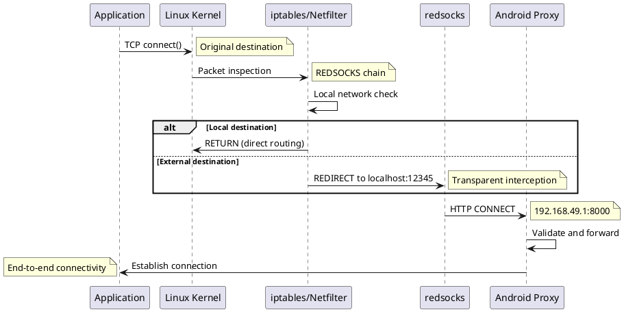

# PdaNet Linux - Security Architecture

**Version:** 1.0
**Date:** 2025-10-04
**Classification:** Internal Use
**Authors:** Security Team

## Executive Summary

This document defines the security architecture for PdaNet Linux, covering threat modeling, security controls, and compliance requirements. The primary security objective is maintaining stealth against carrier detection while protecting user privacy and system integrity.

## Table of Contents

1. [Security Objectives](#1-security-objectives)
2. [Threat Model](#2-threat-model)
3. [Security Architecture Overview](#3-security-architecture-overview)
4. [Defense in Depth Layers](#4-defense-in-depth-layers)
5. [Security Controls](#5-security-controls)
6. [Data Security](#6-data-security)
7. [Network Security](#7-network-security)
8. [System Security](#8-system-security)
9. [Monitoring and Incident Response](#9-monitoring-and-incident-response)
10. [Compliance and Audit](#10-compliance-and-audit)

---

## 1. Security Objectives

### 1.1 Primary Objectives

| Objective | Description | Success Criteria |
|-----------|-------------|------------------|
| **Stealth Preservation** | Evade carrier detection mechanisms | >95% bypass success rate |
| **Privacy Protection** | Prevent traffic analysis and user identification | No DNS leaks, IP attribution protection |
| **System Integrity** | Maintain secure system configuration | No unauthorized privilege escalation |
| **Data Confidentiality** | Protect user credentials and configuration | No plaintext secrets, secure storage |

### 1.2 Security Principles

1. **Defense in Depth:** Multiple security layers protect against different attack vectors
2. **Least Privilege:** Minimal permissions for all components and users
3. **Fail Secure:** System defaults to secure state on errors or failures
4. **Transparency:** Security mechanisms don't interfere with legitimate usage
5. **Auditability:** All security-relevant events are logged and traceable

---

## 2. Threat Model

### 2.1 Assets

**Primary Assets:**
- User internet traffic and metadata
- System configuration and credentials
- Connection logs and statistics
- Carrier bypass techniques and effectiveness data

**Supporting Assets:**
- PdaNet Linux application and scripts
- System privileges and network access
- User device and Android phone
- Network interfaces and routing tables

### 2.2 Threat Actors

#### Threat Actor 1: Mobile Carriers
**Motivation:** Enforce tethering policies, prevent unauthorized usage
**Capabilities:**
- Deep Packet Inspection (DPI) equipment
- Machine Learning traffic analysis
- TTL and IPv6 correlation analysis
- Bandwidth throttling and connection blocking

**Attack Vectors:**
- Traffic pattern analysis
- Protocol fingerprinting
- Behavioral profiling
- Infrastructure-level detection

#### Threat Actor 2: Malicious Websites/Services
**Motivation:** Exploit proxy connections, steal credentials, malware distribution
**Capabilities:**
- Web-based attacks (XSS, CSRF, malware)
- Proxy exploitation techniques
- Social engineering
- Network reconnaissance

**Attack Vectors:**
- Malicious HTTP responses through proxy
- DNS hijacking attempts
- Man-in-the-middle attacks
- Browser exploitation

#### Threat Actor 3: Local Attackers
**Motivation:** Privilege escalation, data theft, system compromise
**Capabilities:**
- Local account access
- Social engineering
- Physical device access
- Software exploitation

**Attack Vectors:**
- Sudo privilege abuse
- Configuration file tampering
- Log file analysis
- Process injection/hijacking

#### Threat Actor 4: State/Corporate Surveillance
**Motivation:** Traffic monitoring, user identification, data collection
**Capabilities:**
- Advanced persistent threats (APT)
- Zero-day exploits
- Infrastructure compromise
- Legal/regulatory pressure

**Attack Vectors:**
- Network infrastructure compromise
- Software supply chain attacks
- Metadata correlation analysis
- Legal data requests

### 2.3 Attack Scenarios

#### Scenario 1: Carrier Detection and Blocking
**Attack Flow:**
1. Carrier deploys new ML-based detection system
2. System analyzes traffic patterns and identifies tethering signatures
3. Carrier throttles or blocks connection
4. User loses internet access or experiences degraded performance

**Impact:** High (loss of primary functionality)
**Likelihood:** Medium (ongoing carrier evolution)

#### Scenario 2: Proxy Exploitation
**Attack Flow:**
1. User visits malicious website through PdaNet proxy
2. Website exploits HTTP CONNECT protocol weaknesses
3. Attacker gains insight into proxy configuration or intercepts traffic
4. Potential for traffic redirection or credential theft

**Impact:** Medium (privacy compromise)
**Likelihood:** Low (requires specific expertise and user interaction)

#### Scenario 3: Privilege Escalation via Sudo Rules
**Attack Flow:**
1. Attacker gains local user account access
2. Exploits PdaNet sudo rules to execute privileged commands
3. Escalates to root privileges through script vulnerabilities
4. Achieves full system compromise

**Impact:** High (full system compromise)
**Likelihood:** Low (requires local access and specific vulnerabilities)

---

## 3. Security Architecture Overview

### 3.1 Security Zones

```
┌─────────────────────────────────────────────────────────────┐
│                        Internet Zone                         │
│                   (Untrusted, External)                     │
└─────────────────────┬───────────────────────────────────────┘
                      │
┌─────────────────────▼───────────────────────────────────────┐
│                   Carrier Network                           │
│                 (Hostile, Monitored)                        │
└─────────────────────┬───────────────────────────────────────┘
                      │
┌─────────────────────▼───────────────────────────────────────┐
│                  Android Device                             │
│               (Semi-Trusted, Proxy)                         │
│  ┌─────────────────────────────────────────────────────┐   │
│  │            PdaNet+ Proxy Server                     │   │
│  │         (192.168.49.1:8000)                       │   │
│  └─────────────────────────────────────────────────────┘   │
└─────────────────────┬───────────────────────────────────────┘
                      │ USB/WiFi
┌─────────────────────▼───────────────────────────────────────┐
│                   Linux System                              │
│                 (Trusted, Controlled)                       │
│  ┌─────────────────────────────────────────────────────┐   │
│  │              Kernel Space                           │   │
│  │  ┌─────────────────────────────────────────────┐   │   │
│  │  │            iptables/Netfilter               │   │   │
│  │  │         (Security Enforcement)              │   │   │
│  │  └─────────────────────────────────────────────┘   │   │
│  └─────────────────────────────────────────────────────┘   │
│  ┌─────────────────────────────────────────────────────┐   │
│  │               User Space                            │   │
│  │  ┌─────────────────────────────────────────────┐   │   │
│  │  │           PdaNet Linux                      │   │   │
│  │  │        (Privilege Separation)               │   │   │
│  │  └─────────────────────────────────────────────┘   │   │
│  │  ┌─────────────────────────────────────────────┐   │   │
│  │  │              redsocks                       │   │   │
│  │  │         (Transparent Proxy)                 │   │   │
│  │  └─────────────────────────────────────────────┘   │   │
│  └─────────────────────────────────────────────────────┘   │
└─────────────────────────────────────────────────────────────┘
```

### 3.2 Security Boundaries

1. **Network Boundary:** Linux system ↔ Android device
2. **Process Boundary:** User applications ↔ PdaNet Linux
3. **Privilege Boundary:** User space ↔ Kernel space (iptables)
4. **Trust Boundary:** Local system ↔ External networks

---

## 4. Defense in Depth Layers

### 4.1 Layer 1: Stealth and Evasion

**Purpose:** Prevent detection by carrier monitoring systems

**Controls:**
- TTL normalization to 65 for all outgoing packets
- Complete IPv6 blocking to prevent protocol correlation
- DNS query redirection through phone gateway
- OS update traffic blocking (Windows, Ubuntu, Mac signatures)
- MSS/MTU clamping for packet size normalization

**Implementation:**
```bash
# Example stealth controls
iptables -t mangle -A WIFI_STEALTH -j TTL --ttl-set 65
sysctl -w net.ipv6.conf.wlan0.disable_ipv6=1
iptables -t nat -A OUTPUT -o wlan0 -p udp --dport 53 -j DNAT --to $GATEWAY:53
```

### 4.2 Layer 2: Network Security

**Purpose:** Protect against network-based attacks and traffic interception

**Controls:**
- Transparent proxy routing with local network exclusions
- DNS leak prevention and validation
- Certificate pinning for critical connections
- Traffic encryption enforcement where possible

**Implementation:**
```bash
# Local network exclusion from proxy routing
iptables -t nat -A REDSOCKS -d 127.0.0.0/8 -j RETURN
iptables -t nat -A REDSOCKS -d 192.168.0.0/16 -j RETURN
iptables -t nat -A REDSOCKS -d 10.0.0.0/8 -j RETURN
```

### 4.3 Layer 3: Application Security

**Purpose:** Secure PdaNet Linux application and prevent exploitation

**Controls:**
- Input validation for all user inputs and configuration files
- Secure file permissions (600 for sensitive files)
- Process isolation and privilege separation
- Error handling without information disclosure

**Implementation:**
```python
# Example input validation
def validate_interface_name(interface):
    """Validate network interface name against injection attacks"""
    if not re.match(r'^[a-zA-Z0-9]+$', interface):
        raise ValueError("Invalid interface name")
    if len(interface) > 15:  # IFNAMSIZ limit
        raise ValueError("Interface name too long")
    return interface
```

### 4.4 Layer 4: System Security

**Purpose:** Protect underlying Linux system and prevent privilege escalation

**Controls:**
- Minimal sudo privileges with specific command restrictions
- Secure temporary file handling with proper cleanup
- System resource limits and monitoring
- Audit logging for privileged operations

**Implementation:**
```bash
# /etc/sudoers.d/pdanet-linux - Minimal privileges
wtyler ALL=(root) NOPASSWD: /usr/local/bin/pdanet-connect
wtyler ALL=(root) NOPASSWD: /usr/local/bin/pdanet-disconnect
wtyler ALL=(root) NOPASSWD: /usr/local/bin/pdanet-wifi-connect
wtyler ALL=(root) NOPASSWD: /usr/local/bin/pdanet-wifi-disconnect
```

---

## 5. Security Controls

### 5.1 Authentication and Authorization

**No Network Authentication Required:**
- PdaNet+ proxy requires no credentials (by design)
- Android device trust established through physical connection
- System access controlled through Linux user permissions

**Authorization Matrix:**

| Component | User | Admin | Root | Purpose |
|-----------|------|-------|------|---------|
| GUI Application | R/W | R/W | R/W | User interface and configuration |
| Connection Scripts | X | X | X | Network interface management |
| iptables Rules | - | - | R/W | Packet filtering and routing |
| Configuration Files | R/W | R/W | R/W | Settings and preferences |
| Log Files | R | R/W | R/W | Troubleshooting and audit |

### 5.2 Data Protection

**Configuration Security:**
```python
# Secure configuration file handling
def save_config(config_data):
    """Save configuration with secure permissions"""
    config_file = os.path.expanduser('~/.config/pdanet-linux/settings.json')

    # Create secure temporary file
    fd, temp_path = tempfile.mkstemp(dir=os.path.dirname(config_file))
    try:
        with os.fdopen(fd, 'w') as f:
            json.dump(config_data, f, indent=2)

        # Set secure permissions before moving
        os.chmod(temp_path, 0o600)
        os.rename(temp_path, config_file)
    except:
        os.unlink(temp_path)
        raise
```

**Log Security:**
- Rotating logs with automatic cleanup
- No sensitive data in log files (IP addresses, credentials)
- Structured logging for security event correlation
- Secure log file permissions (640)

### 5.3 Network Security Controls

**Traffic Isolation:**
```bash
# Prevent routing loops and local network access
iptables -t nat -N REDSOCKS
iptables -t nat -A REDSOCKS -d 0.0.0.0/8 -j RETURN
iptables -t nat -A REDSOCKS -d 127.0.0.0/8 -j RETURN
iptables -t nat -A REDSOCKS -d 192.168.0.0/16 -j RETURN
iptables -t nat -A REDSOCKS -d 172.16.0.0/12 -j RETURN
iptables -t nat -A REDSOCKS -d 10.0.0.0/8 -j RETURN
```

**DNS Security:**
- Force all DNS queries through phone gateway
- Block known malicious DNS servers
- Prevent DNS over HTTPS (DoH) leaks
- Monitor for DNS hijacking attempts

---

## 6. Data Security

### 6.1 Data Classification

| Data Type | Classification | Sensitivity | Storage Requirements |
|-----------|---------------|-------------|-------------------|
| User traffic content | Confidential | High | Not stored, proxy-only |
| Connection metadata | Internal | Medium | Encrypted logs, limited retention |
| Configuration settings | Internal | Medium | Secure file permissions |
| Application logs | Internal | Low | Rotating, sanitized logs |
| System credentials | Restricted | High | No storage (runtime only) |

### 6.2 Data Lifecycle

**Configuration Data:**
- **Creation:** Secure defaults, user validation
- **Storage:** JSON files with 600 permissions
- **Access:** Process-isolated, input validated
- **Modification:** Atomic updates, backup retention
- **Destruction:** Secure deletion on uninstall

**Log Data:**
- **Creation:** Structured, sanitized entries
- **Storage:** Rotating files, size limits
- **Access:** Read-only for users, admin access for analysis
- **Retention:** 30 days default, configurable
- **Destruction:** Automatic rotation, secure deletion

### 6.3 Privacy Protection

**Traffic Privacy:**
- No content inspection or logging
- Metadata minimization (connection stats only)
- IP address anonymization in logs
- No user identification or tracking

**System Privacy:**
- No telemetry or usage reporting
- No external connections except proxy traffic
- Minimal fingerprinting information collection
- User control over all data sharing

---

## 7. Network Security

### 7.1 Traffic Flow Security



### 7.2 Attack Surface Reduction

**Exposed Services:**
- **redsocks:** Localhost only (127.0.0.1:12345)
- **GUI Application:** Local user session only
- **No network listeners:** No external attack surface

**Network Interfaces:**
- USB tethering: Point-to-point, no broadcast
- WiFi connection: Client mode only, no AP functionality
- Loopback: Standard localhost services

### 7.3 Traffic Validation

**Proxy Validation:**
```python
def validate_proxy_connection():
    """Validate PdaNet proxy availability and security"""
    try:
        # Test basic connectivity
        response = requests.get(
            'http://www.google.com',
            proxies={'http': 'http://192.168.49.1:8000'},
            timeout=10
        )

        # Validate response integrity
        if response.status_code != 200:
            raise ConnectionError("Proxy returned unexpected status")

        # Check for proxy-injected content
        if 'proxy-injected' in response.headers:
            log_security_warning("Proxy content injection detected")

        return True
    except Exception as e:
        log_security_event("Proxy validation failed", str(e))
        return False
```

---

## 8. System Security

### 8.1 Privilege Management

**Principle of Least Privilege:**
- GUI runs with user permissions only
- Scripts require minimal sudo for specific commands
- No persistent root processes
- Temporary privilege elevation with immediate drop

**Sudo Configuration Validation:**
```bash
#!/bin/bash
# Validate sudoers configuration security
validate_sudoers() {
    local sudoers_file="/etc/sudoers.d/pdanet-linux"

    # Check file permissions
    if [[ $(stat -c %a "$sudoers_file") != "440" ]]; then
        echo "ERROR: Incorrect sudoers file permissions"
        return 1
    fi

    # Validate no wildcards in commands
    if grep -q '\*' "$sudoers_file"; then
        echo "ERROR: Wildcard commands in sudoers"
        return 1
    fi

    # Check for NOPASSWD safety
    if ! grep -q "NOPASSWD:" "$sudoers_file"; then
        echo "WARNING: Password-required sudo (may impact automation)"
    fi

    return 0
}
```

### 8.2 Process Security

**Process Isolation:**
- Each component runs in separate process space
- No shared memory between untrusted components
- Signal handling for graceful shutdown
- Resource limits to prevent DoS

**Memory Security:**
```python
# Secure memory handling for sensitive data
import mlock

class SecureConfig:
    def __init__(self):
        self._secure_data = mlock.mlocked_memory(1024)

    def store_sensitive(self, data):
        """Store sensitive data in locked memory"""
        if len(data) > len(self._secure_data):
            raise ValueError("Data too large for secure storage")
        self._secure_data[:len(data)] = data.encode()

    def clear_sensitive(self):
        """Securely clear sensitive data"""
        self._secure_data[:] = b'\x00' * len(self._secure_data)
```

### 8.3 File System Security

**File Permissions:**
```bash
# Secure file permission enforcement
/usr/local/bin/pdanet-*          755 (root:root)
/etc/redsocks.conf               644 (root:root)
/etc/sudoers.d/pdanet-linux     440 (root:root)
~/.config/pdanet-linux/         750 (user:user)
~/.config/pdanet-linux/*.json   600 (user:user)
~/.config/pdanet-linux/logs/    755 (user:user)
```

**Secure Temporary Files:**
```python
def create_secure_temp():
    """Create temporary file with secure permissions"""
    fd, path = tempfile.mkstemp(prefix='pdanet_', suffix='.tmp')
    os.chmod(path, 0o600)  # Owner read/write only
    return fd, path
```

---

## 9. Monitoring and Incident Response

### 9.1 Security Monitoring

**Security Events to Monitor:**
1. **Connection Anomalies:**
   - Repeated connection failures
   - Unusual latency patterns
   - Bandwidth throttling indicators
   - Proxy response anomalies

2. **System Events:**
   - Privilege escalation attempts
   - Configuration file modifications
   - Unusual process behavior
   - Resource exhaustion

3. **Network Events:**
   - DNS query anomalies
   - Traffic pattern changes
   - iptables rule modifications
   - Interface state changes

**Monitoring Implementation:**
```python
class SecurityMonitor:
    def __init__(self):
        self.alert_thresholds = {
            'failed_connections': 5,
            'latency_spike': 1000,  # ms
            'bandwidth_drop': 0.5   # 50% reduction
        }

    def monitor_connection_health(self):
        """Monitor for security-relevant connection issues"""
        stats = self.get_connection_stats()

        if stats['failed_connections'] > self.alert_thresholds['failed_connections']:
            self.raise_security_alert("Excessive connection failures", stats)

        if stats['latency'] > self.alert_thresholds['latency_spike']:
            self.raise_security_alert("Latency spike detected", stats)

    def raise_security_alert(self, event, data):
        """Log security alert and take response action"""
        log_security_event(event, data)
        if self.is_critical_event(event):
            self.initiate_incident_response(event, data)
```

### 9.2 Incident Response

**Response Levels:**

**Level 1 - Information:**
- Log event for analysis
- Continue normal operation
- Schedule review for next maintenance window

**Level 2 - Warning:**
- Log event with elevated priority
- Notify user through GUI
- Increase monitoring frequency

**Level 3 - Critical:**
- Immediate response required
- Disconnect and disable stealth mode
- Notify user with error dialog
- Preserve evidence for analysis

**Incident Response Playbook:**

```python
def incident_response(severity, event_type, event_data):
    """Execute incident response based on severity"""

    if severity == "CRITICAL":
        # Immediate protection
        connection_manager.emergency_disconnect()
        stealth_manager.disable_all_layers()

        # Evidence preservation
        capture_system_state()
        preserve_log_files()

        # User notification
        gui.show_security_alert(event_type, "Connection disabled for security")

    elif severity == "WARNING":
        # Enhanced monitoring
        increase_monitoring_frequency()

        # User notification
        gui.show_warning_notification(event_type)

    # Always log
    log_security_incident(severity, event_type, event_data)
```

### 9.3 Forensics and Analysis

**Evidence Collection:**
- System state snapshots (network interfaces, routing tables)
- Application logs with correlation IDs
- Network traffic metadata (no content)
- Configuration file checksums

**Analysis Tools:**
```bash
# Security analysis script
#!/bin/bash
collect_security_evidence() {
    local incident_dir="/tmp/pdanet_incident_$(date +%s)"
    mkdir -p "$incident_dir"

    # Network state
    ip route > "$incident_dir/routing_table.txt"
    iptables -L -v -n > "$incident_dir/iptables_rules.txt"
    netstat -tuln > "$incident_dir/network_connections.txt"

    # System state
    ps aux | grep pdanet > "$incident_dir/processes.txt"
    lsof -p $(pgrep pdanet) > "$incident_dir/open_files.txt"

    # Application logs
    cp ~/.config/pdanet-linux/logs/* "$incident_dir/"

    # Configuration
    cp ~/.config/pdanet-linux/*.json "$incident_dir/"

    echo "Evidence collected in: $incident_dir"
}
```

---

## 10. Compliance and Audit

### 10.1 Security Audit Framework

**Audit Scope:**
- Configuration security review
- Privilege escalation testing
- Network security validation
- Code security analysis
- Dependency vulnerability assessment

**Audit Schedule:**
- **Quarterly:** Full security review
- **Monthly:** Dependency updates and vulnerability scanning
- **Weekly:** Configuration validation
- **Daily:** Automated security monitoring

### 10.2 Security Testing

**Penetration Testing Scenarios:**
1. **Local Privilege Escalation:**
   - Test sudo rule exploitation
   - Configuration file manipulation
   - Process injection attempts

2. **Network Security Testing:**
   - Proxy connection hijacking
   - DNS manipulation
   - Traffic interception

3. **Application Security Testing:**
   - Input validation bypass
   - Configuration injection
   - Race condition exploitation

**Security Test Automation:**
```python
def automated_security_tests():
    """Run automated security validation tests"""

    test_results = {
        'sudo_validation': test_sudo_configuration(),
        'file_permissions': test_file_permissions(),
        'network_isolation': test_network_isolation(),
        'input_validation': test_input_validation(),
        'dependency_scan': test_dependency_vulnerabilities()
    }

    failed_tests = [test for test, result in test_results.items() if not result]

    if failed_tests:
        log_security_warning(f"Security tests failed: {failed_tests}")
        return False

    log_security_info("All security tests passed")
    return True
```

### 10.3 Compliance Requirements

**Privacy Compliance:**
- No user data collection without explicit consent
- Data minimization principles applied
- User control over all data sharing
- Transparent privacy practices

**Security Standards:**
- Industry best practices for privilege separation
- Secure coding standards (input validation, error handling)
- Network security controls (encryption, isolation)
- Incident response procedures

**Documentation Requirements:**
- Security architecture documentation (this document)
- Security procedures and playbooks
- Risk assessment and mitigation strategies
- Security test results and audit reports

---

## Appendix A: Security Configuration Reference

### A.1 iptables Security Rules

```bash
# Complete security-focused iptables configuration
setup_security_rules() {
    # Create security chains
    iptables -t filter -N PDANET_SECURITY
    iptables -t nat -N PDANET_SECURITY
    iptables -t mangle -N PDANET_SECURITY

    # Drop malformed packets
    iptables -A PDANET_SECURITY -m state --state INVALID -j DROP

    # Rate limiting to prevent DoS
    iptables -A PDANET_SECURITY -p tcp --dport 80 -m limit --limit 25/minute --limit-burst 100 -j ACCEPT

    # Block known malicious IPs (example)
    iptables -A PDANET_SECURITY -s 1.2.3.4 -j DROP

    # Log security events
    iptables -A PDANET_SECURITY -j LOG --log-prefix "PDANET_SEC: " --log-level 4
}
```

### A.2 Secure Configuration Template

```json
{
  "security": {
    "stealth_level": 3,
    "monitoring_enabled": true,
    "incident_response": true,
    "log_level": "INFO",
    "max_log_size": "10MB",
    "log_retention_days": 30
  },
  "network": {
    "dns_validation": true,
    "certificate_pinning": false,
    "ipv6_blocking": true,
    "local_network_exclusion": true
  },
  "system": {
    "secure_temp_files": true,
    "memory_protection": true,
    "process_isolation": true,
    "resource_limits": true
  }
}
```

---

**Document Control:**
- **Classification:** Internal Use
- **Next Review:** 2025-01-04
- **Approval:** Security Team, Architecture Review Board
- **Distribution:** Development Team, Security Team, Operations